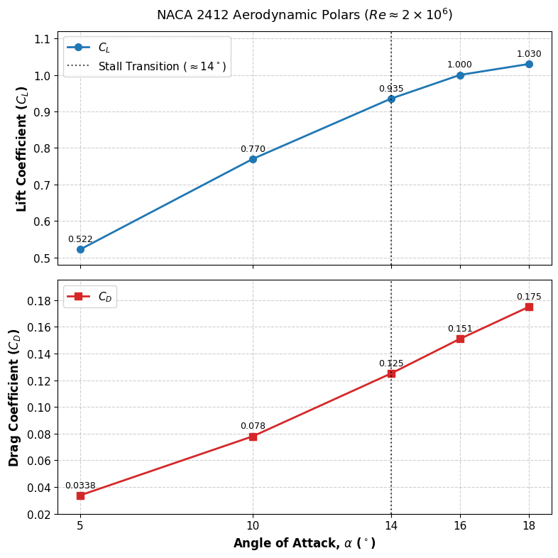

# NACA 2412 Airfoil Aerodynamic Polars Analysis

## Project Overview
This project is a 2D Computational Fluid Dynamics (CFD) investigation evaluating the aerodynamic performance and boundary layer separation characteristics of a NACA 2412 airfoil. Operating at a Reynolds number of $Re \approx 2 \times 10^6$, this study quantifies the lift ($C_L$) and drag ($C_D$) coefficients across angles of attack ranging from $\alpha = 5^\circ$ to $18^\circ$, identifying key transition thresholds and post-stall behavior.

## Key Engineering Insights & Aerodynamic Observations
* **Peak Efficiency Region:** At $\alpha = 5^\circ$, attached boundary layer flow produces the maximum aerodynamic efficiency ($C_L / C_D = 15.44$) with $C_L = 0.522$ and minimal baseline pressure drag ($C_D = 0.0338$).
* **Stall Transition Knee ($\alpha \approx 14^\circ$):** Flow remains predominantly attached through $\alpha = 10^\circ$, but strong adverse pressure gradients begin inducing boundary layer separation near $\alpha = 14^\circ$, creating a pronounced inflection point in the lift slope.
* **Post-Stall Drag Penalty:** Increasing $\alpha$ from $14^\circ$ to $18^\circ$ yields minimal lift gain ($C_L$ flattens from $0.935$ to $1.030$) while drag increases rapidly by $40\%$ ($C_D = 0.1750$), reducing overall glide ratio down to $5.89$.

## Simulation Data Summary

| Angle of Attack ($\alpha$) | Lift Coeff. ($C_L$) | Drag Coeff. ($C_D$) | Efficiency ($C_L / C_D$) | Flow Regime / Status |
| :---: | :---: | :---: | :---: | :--- |
| **$5^\circ$** | **0.522** | **0.0338** | **15.44** | **Attached Flow (Peak $C_L/C_D$)** |
| $10^\circ$ | 0.770 | 0.0780 | 9.87 | Linear Lift Region |
| **$14^\circ$** | **0.935** | **0.1250** | **7.48** | **Incipient Separation / Stall Knee** |
| $16^\circ$ | 1.000 | 0.1510 | 6.62 | Stall Onset / Peak $C_L$ Region |
| $18^\circ$ | 1.030 | 0.1750 | 5.89 | Fully Separated Flow |

## Repository Files
* `plot_polars.py` — Python post-processing script using `matplotlib` and `numpy` to generate dual-panel polar plots with custom annotations and scaling.
* `NACA2412_Aerodynamic_Polars.png` — Exported high-resolution figure illustrating $C_L$ and $C_D$ trends vs. $\alpha$.
* `README.md` — Technical project summary and aerodynamic performance overview.

## Tech Stack & Tools Used
* **CFD Solver:** ANSYS Fluent (2D RANS / Incompressible Flow)
* **Programming Language:** Python 3.x
* **Visualization Libraries:** `matplotlib`, `numpy`
